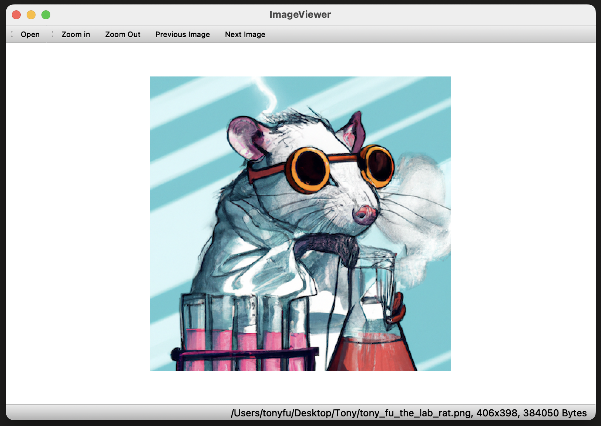

# Chapter 01: Image Viewer - Learning Reflections

**Author**: Tony Fu  
**Date**: August 6, 2023

**Reference**: [Qt 5 and OpenCV 4 Computer Vision Projects](https://github.com/PacktPublishing/Qt-5-and-OpenCV-4-Computer-Vision-Projects/tree/master) by Zhuo Qingliang



## Setting Up Development Environment
- **VS Code Integration**: 
  - If VS Code doesn't recognize the Qt libraries, edit `c_cpp_properties.json` and add `"/Users/myName/opt/anaconda3/include/qt/**"` to `includePath`.

- **Compiling the Project**: 
  ```bash
  qmake -project
  qmake -makefile
  make
  ```
  Make sure to specify the `HEADERS` and `SOURCES` in the `.pro` file. `qmake` might not automatically detect them. After compilation, run the generated executable.

- **Qt5 Configuration**:
  - When using Qt5, add the following line to the `.pro` file generated by `qmake`:
    ```qml
    greaterThan(QT_MAJOR_VERSION, 4): QT += widgets
    ```

## Core Concepts

- **Scene vs. View**:
  - **Scene**: Represents the content. For instance, to add an image: `currentImage = imageScene->addPixmap(image)`. This returns a pointer to a `QGraphicsPixmapItem`, which is Qt's way of handling images.
  - **View**: Defines the presentation of the Scene. Adjust the view to the image using `imageView->setSceneRect(image.rect())` and zoom in with `imageView->scale(1.2, 1.2)`.

- **Slot-Signal-Action System in Qt**

    Qt applications are event-driven. It runs in a loop, waiting for the user to perform some action like a mouse click. And when these events happen, they need a way to notify the application's logic so it can respond appropriately.

    - **Signals** are used to notify other objects that something has happened. They are a broadcasting station: when an event occurs, the signal related to that event is emitted/broadcasted.

    - **Slots** are normal C++ member functions that can be public, private, or protected.

    - **Actions** are high-level abstractions over commands that can be performed. In Qt, an `QAction` object represents an abstract user interface action that can be inserted into menus, toolbars, and buttons.

    - **Connecting Signals to Slots** 
    The connection between signals and slots, facilitated by the `connect()` function, is what makes the system work. When a signal is emitted—because an event happened—any slot connected to that signal is automatically called.
    ```cpp
    connect(myButton, SIGNAL(clicked()), this, SLOT(handleButtonClicked()));
    ```
    In this example, when `myButton` is clicked and its `clicked()` signal is emitted, the `handleButtonClicked()` slot function is called.

- **Dialogs**:
  - **QFileDialog**: Used to let the user select files or directories.
  - **QMessageBox**: Displays modal dialogs with brief messages and buttons.

- **User Interaction**:
  - Many Qt objects (like `QFileDialog` and `QApplication`) have the `exec()` method, which awaits user action.

- **Loading Images**:
  ```cpp
  QPixmap image(path);
  QGraphicsPixmapItem *currentImage = imageScene->addPixmap(image);
  imageScene->update();
  ```

- **Directory Operations**:
  ```cpp
  QFileInfo currentInfo(path);
  QDir dir = currentInfo.absoluteDir();   // Get directory containing the current image
  
  QStringList nameFilters = {"*.png", "*.bmp", "*.jpg"};  // Image file extensions
  QStringList fileNames = dir.entryList(nameFilters, QDir::Files, QDir::Name);  // List of image files
  ```

- **Menu Actions**:
  ```cpp
  openAction = new QAction("&Open", this);
  fileMenu->addAction(openAction);
  exitAction = new QAction("E&xit", this);
  fileMenu->addAction(exitAction);
  ```

- **Shortcuts & Mnemonics**:
  - Characters after `&` are mnemonics: use Alt + character to trigger. For example, Alt + x exits the application.
  - Define custom shortcuts:
    ```cpp
    QList<QKeySequence> shortcuts;
    shortcuts << Qt::Key_Plus << Qt::Key_Equal;
    zoomInAction->setShortcuts(shortcuts);
    ```
