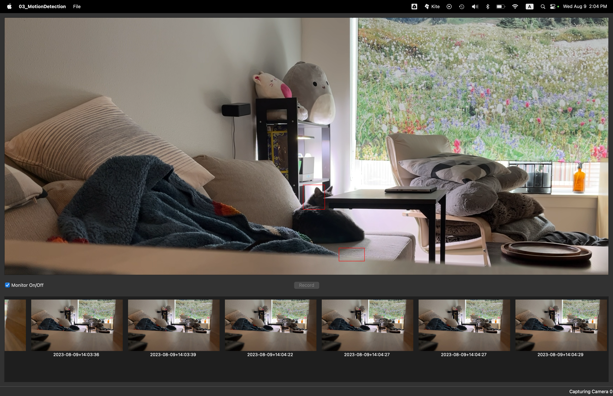

# Motion Detection with Qt and OpenCV: Chapter 03 Reflections

**Author**: Tony Fu  
**Date**: August 8, 2023  
**Device**: MacBook Pro 16 inch, Late 2021 (M1 Pro)  

**Reference**: Chapter 3 of [*Qt 5 and OpenCV 4 Computer Vision Projects*](https://github.com/PacktPublishing/Qt-5-and-OpenCV-4-Computer-Vision-Projects/tree/master) by Zhuo Qingliang

## Results:



## Core Concepts

### 1. Issues Encountered & Solutions:

- **Inclusion of `<QtConcurrency>` & `<QCameraInfo>`**:
  - Problem: Couldn't include the mentioned headers.
  - Solution: Added `QT += core gui multimedia network concurrent` to the `.pro` file and executed `qmake -makefile`.

- **OpenCV Functions' Implementations**:
  - Problem: Difficulty finding OpenCV functions' implementations.
  - Solution: Added `-lopencv_imgcodecs -lopencv_video -lopencv_videoio` to the project's `LIBS` and then executed `qmake -makefile`.

- **App Crash due to Missing `openssl` Library**:
  - Problem: Application crashed on startup because of a missing `openssl` library.
  - Solution: Ran `brew link openssl@3` after finding out `openssl` was installed but not linked.

- **Camera Privacy Error on Startup**:
  - Problem: App crash with an error about accessing privacy-sensitive data.
  - Solution: Added the following to the `Info.plist` file:
    ```xml
    <key>NSCameraUsageDescription</key>
    <string>We need access to the camera to capture video for motion detection.</string>
    ```

- **Black Screen when Capturing Video**:
  - Problem: No video displayed, just a black screen.
  - Solution: Discovered camera #0 was actually my phone's camera which was facing down. Used the phone's camera for testing.

### 2. Qt Layout System:

- **QGridLayout**: Allows positioning of widgets in a grid format.
  - Create an instance:
    ```cpp
    QGridLayout *main_layout = new QGridLayout();
    ```
  - Add widgets:
    ```cpp
    main_layout->addWidget(viewfinder, 0, 0, 12, 1);
    ```

  - Nest other layouts:
    ```cpp
    QGridLayout *tools_layout = new QGridLayout();
    main_layout->addLayout(tools_layout, 12, 0, 1, 1);
    ```

  - Use `setCentralWidget()` to display the main layout:
    ```cpp
    QWidget *widget = new QWidget();
    widget->setLayout(main_layout);
    setCentralWidget(widget);
    ```

You provided a set of instructions and code related to video processing using OpenCV and Qt. Here are some modifications and suggestions to improve the clarity and correctness of your text:

### 3. Using the Camera:
- First, determine which camera you want to use: `QList<QCameraInfo> cameras = QCameraInfo::availableCameras()`.

- To capture video:
  1. **Initialize VideoCapture**:
    ```cpp
    #include <opencv2/opencv.hpp>
    cv::VideoCapture cap(0); // Open the default camera (usually the first one)

    if(!cap.isOpened()) {
        std::cout << "Error: Camera not found!" << std::endl;
        return -1;
    }
    ```

  2. **Capture Video Frames**:
    Capture video frames in a loop and display them using OpenCV's `imshow` function:

    ```cpp
    cv::Mat frame;
    while(true) {
        cap >> frame; // Capture a frame

        if(frame.empty()) break; // End the loop if the frame is empty

        cv::imshow("Captured Video", frame); // Display the frame

        if(cv::waitKey(1) >= 0) break; // Exit on any key press
    }
    ```

  3. **Release Resources**:
    Ensure you release resources after using them:
    ```cpp
    cap.release();
    cv::destroyAllWindows();
    ```

### 4. Multithreading with Qt:
The while loop above can block the main application, rendering the app unresponsive. Utilize a separate thread for video capture using the `QThread` class.

1. Create a public subclass of QThread:
    ```cpp
    class CaptureThread : public QThread
    {
      Q_OBJECT
    protected:
      void run() override; 
    };
    ```

2. Override the `run()` method. For our purpose, insert the above loop into this method:
    ```cpp
    void CaptureThread::run() {
      bool running = true;
      cv::VideoCapture cap(cameraID);

      while(running) {
          cap >> tmp_frame;

          // Convert frame color from BGR to RGB
          cvtColor(tmp_frame, tmp_frame, cv::COLOR_BGR2RGB);

          // Thread-safe frame update
          data_lock->lock();
          frame = tmp_frame;
          data_lock->unlock();

          // Emit a signal across threads, informing that a new frame has been captured
          emit frameCaptured(&frame);
      }

      // Cleanup
      cap.release();
      running = false;
    }
    ```

3. Ensure that when updating the `cv::Mat frame`, lock the `QMutex *data_lock` for thread safety.

4. Emit a signal, `void frameCaptured(cv::Mat *data)`, after updating the frame.

### 5. Motion Detection using Background Subtraction:
1. Subtract the stored frame from the current one:
    ```cpp
    cv::Ptr<cv::BackgroundSubtractorMOG2> segmentor = cv::createBackgroundSubtractorMOG2(500, 16, true);
    cv::Mat fgmask;
    segmentor->apply(frame, fgmask);
    if (fgmask.empty())
    {
        return;
    }
    ```

2. Noise handling 1: Binary thresholding:
    ```cpp
    cv::threshold(fgmask, fgmask, 25, 255, cv::THRESH_BINARY);
    ```

3. Noise handling 2: Erode the speckles and small blobs:
    ```cpp
    int noise_size = 9;
    cv::Mat kernel = cv::getStructuringElement(cv::MORPH_RECT, cv::Size(noise_size, noise_size));
    cv::erode(fgmask, fgmask, kernel);
    ```

   Note: `cv::MORPH_RECT` results in a matrix filled with ones, similar to manually creating a `cv::Mat` of ones. We use `cv::getStructuringElement()` for clarity.

4. Noise handling 3: Dilation to fill small holes:
    ```cpp
    cv::dilate(fgmask, fgmask, kernel, cv::Point(-1, -1), 3);
    ```

5. The binary mask now contains white pixel blobs or patches, each signifying a distinct moving object or motion area in the scene. Use contour detection to delineate these regions:
    ```cpp
    std::vector<std::vector<cv::Point>> contours;
    cv::findContours(fgmask, contours, cv::RETR_TREE, cv::CHAIN_APPROX_SIMPLE);

    bool has_motion = contours.size() > 0;
    ```

6. Draw bounding boxes around the identified motion:
    ```cpp
    cv::Scalar color(0, 255, 0);  // Green color for the bounding box
    for (size_t i = 0; i < contours.size(); i++)
    {
        cv::Rect rect = cv::boundingRect(contours[i]);
        cv::rectangle(frame, rect, color, 1);
    }
    ```
