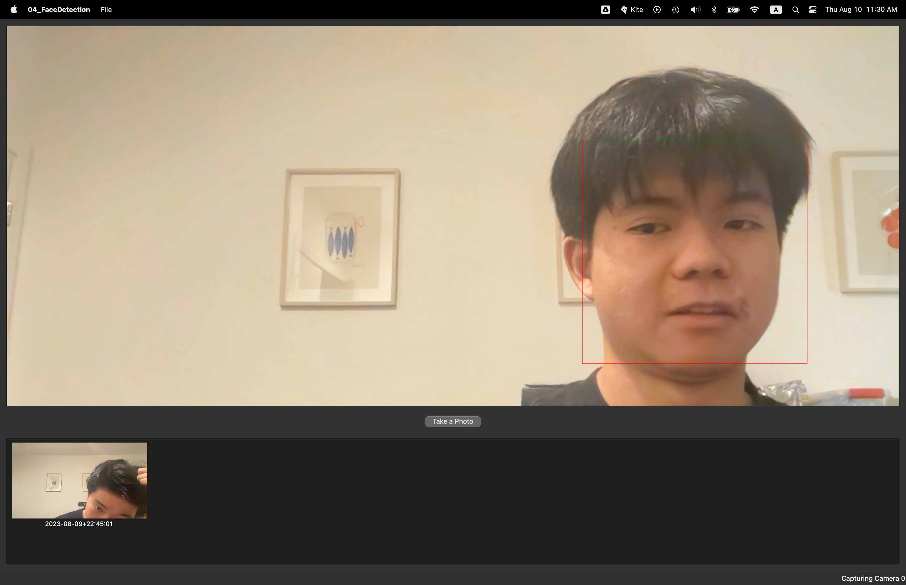
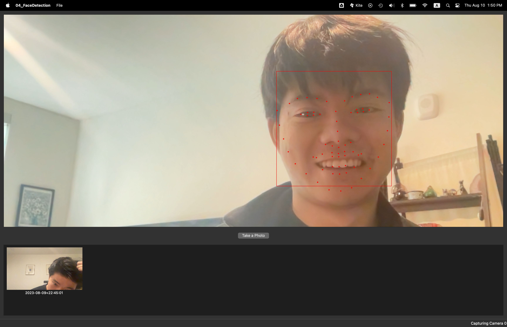

# Face Detection with Qt and OpenCV: Chapter 04 Reflections

**Author**: Tony Fu  
**Date**: August 9, 2023  
**Device**: MacBook Pro 16 inch, Late 2021 (M1 Pro)  

**Reference**: Chapter 4 of [*Qt 5 and OpenCV 4 Computer Vision Projects*](https://github.com/PacktPublishing/Qt-5-and-OpenCV-4-Computer-Vision-Projects/tree/master) by Zhuo Qingliang

## Core Concepts

### 1. Issues Encountered & Solutions:

- **`resetMatrix` is deprecated:**  
  **Solution**: Swap `imageView->resetMatrix();` with `imageView->resetTransform();`. I had encountered this deprecation warning in earlier chapters but had previously overlooked it.

- **Post-closure app crash:**  
  The following error emerged after shutting down the app:
  ```
  Thread 6 Crashed:: CaptureThread
  0   libopencv_core.4.8.0.dylib    	       0x10493b4e8 cv::parallel_for_(cv::Range const&, cv::ParallelLoopBody const&, double) + 516
  1   libopencv_core.4.8.0.dylib    	       0x10493b4dc cv::parallel_for_(cv::Range const&, cv::ParallelLoopBody const&, double) + 504
  2   libopencv_imgproc.4.8.0.dylib 	       0x104e5db10 cv::hal::cvtBGRtoBGR(unsigned char const*, unsigned long, unsigned char*, unsigned long, int, int, int, int, int, bool) + 196
  3   libopencv_imgproc.4.8.0.dylib 	       0x104e60c6c cv::cvtColorBGR2BGR(cv::_InputArray const&, cv::_OutputArray const&, int, bool) + 432
  4   libopencv_imgproc.4.8.0.dylib 	       0x104e4796c cv::cvtColor(cv::_InputArray const&, cv::_OutputArray const&, int, int) + 2212
  5   04_FaceDetection              	       0x1044b94d4 CaptureThread::run() + 216
  6   QtCore                        	       0x106849e44 0x106828000 + 138820
  7   libsystem_pthread.dylib       	       0x1a2c2a06c _pthread_start + 148
  8   libsystem_pthread.dylib       	       0x1a2c24e2c thread_start + 8
  ```
  This points to a potential issue in `CaptureThread::run()`, suggesting inadequate cleanup.  
  **Solution**: Still under investigation.

- **Unable to load facial landmark detector**: Got the following error
  ```
  libc++abi: terminating with uncaught exception of type cv::Exception: OpenCV(4.8.0) /tmp/opencv-20230706-51996-4zw318/opencv-4.8.0/opencv_contrib/modules/face/src/facemarkLBF.cpp:487: error: (-5:Bad argument) No valid input file was given, please check the given filename. in function 'loadModel'

  zsh: abort      ./04_FaceDetection.app/Contents/MacOS/04_FaceDetection
  ```
  **Solution**: Again, this is because the executable on macOS is nested. We need to define the model path like this: `QString model_path = QApplication::instance()->applicationDirPath() + "/../../../models/lbfmodel.yaml";`

- **App crashed after streaming with facial landmark detector**: Got the following error
```
libc++abi: terminating with uncaught exception of type cv::Exception: OpenCV(4.8.0) /tmp/opencv-20230706-51996-4zw318/opencv-4.8.0/opencv_contrib/modules/face/src/facemarkLBF.cpp:430: error: (-5:Bad argument) The LBF model is not trained yet. Please provide a trained model. in function 'fitImpl'

zsh: abort      ./04_FaceDetection.app/Contents/MacOS/04_FaceDetection
```
**Solution**: Forget to load the model using `mark_detector->loadModel(model_path.toStdString());`.

### 2. Face Detection with Haar Cascade:

- **Classifier Storage**:  
  Haar cascade classifiers are located in `/opt/homebrew/share/opencv4/haarcascades/` in XML format. There are also Local Binary Patterns (LBP) cascades located in `/opt/homebrew/share/opencv4/lbpcascades/`. The latter is faster but tends to be less precise.

- **Haar Cascade Implementation**:  
  To integrate the Haar Cascade classifiers:
  - Append `-lopencv_objdetect` to the LIBS within the .pro file.
  - Incorporate the `DEFINES += OPENCV_DATA_DIR=\\\"/opt/homebrew/share/opencv4/\\\"` macro. This will be referenced later during classifier loading.

  Here's a simple guide to face detection:
  ```cpp
  #include "opencv2/objdetect.hpp"

  cv::CascadeClassifier *classifier = new cv::CascadeClassifier(OPENCV_DATA_DIR "haarcascades/haarcascade_frontalface_default.xml");
  
  while (running)
  {
      cap >> tmp_frame;

      // Face detection process
      vector<cv::Rect> faces;
      cv::Mat gray_frame;
      cv::cvtColor(tmp_frame, gray_frame, cv::COLOR_BGR2GRAY);
      classifier->detectMultiScale(gray_frame, faces, 1.3, 5);

      // Drawing red bounding boxes around detected faces
      cv::Scalar color = cv::Scalar(0, 0, 255); // red
      for (size_t i = 0; i < faces.size(); i++)
      {
          cv::rectangle(tmp_frame, faces[i], color, 1);
      }

      // Continuation of the code (frame update, signal emission, etc.)
  }
  ```

**Results** (sorry I looked very tired): 




### 3. Detecting Facial Landmarks with OpenCV's `face` Module:

- **Installation**: The `opencv2/face/facemark.hpp` library appears to be pre-installed on my laptop. I did not need to undergo the additional build process mentioned in the book. However, ensure that this library is included in the .pro file.

- **Downloading the Pretrained Model**: Use the following command to obtain the pretrained model: 
  ```
  curl -O https://raw.githubusercontent.com/kurnianggoro/GSOC2017/master/data/lbfmodel.yaml
  ```
  After downloading, move it to the `models` directory.

- **Implementing Facial Landmark Detection**:
  To utilize the Haar Cascade classifiers:
  - Add `-lopencv_face` to the LIBS section of the .pro file.

  Below is a brief guide on facial detection and landmarking:
  ```cpp
  cv::Ptr<cv::face::Facemark> mark_detector = cv::face::createFacemarkLBF();
  QString model_path = QApplication::instance()->applicationDirPath() + "/../../../models/lbfmodel.yaml";
  mark_detector->loadModel(model_path.toStdString());

  while (running)
  {
      cap >> tmp_frame;

      // Face detection process (details not shown)
      ...

      // Detecting facial landmarks
      vector<vector<cv::Point2f>> shapes;
      if (mark_detector->fit(frame, faces, shapes))
      {
          // Drawing facial landmarks
          for (unsigned long i = 0; i < faces.size(); i++)
          {
              for (unsigned long k = 0; k < shapes[i].size(); k++)
              {
                  cv::circle(frame, shapes[i][k], 2, color, cv::FILLED);
              }
          }
      }
  }
  ```
  Note that each `cv::Point2f` (a.k.a. `shape`) represents a single landmark point's x and y coordinates on the image. The loop is nested because there can be multiple faces, each of which can have multiple landmark points.

**Results**:


