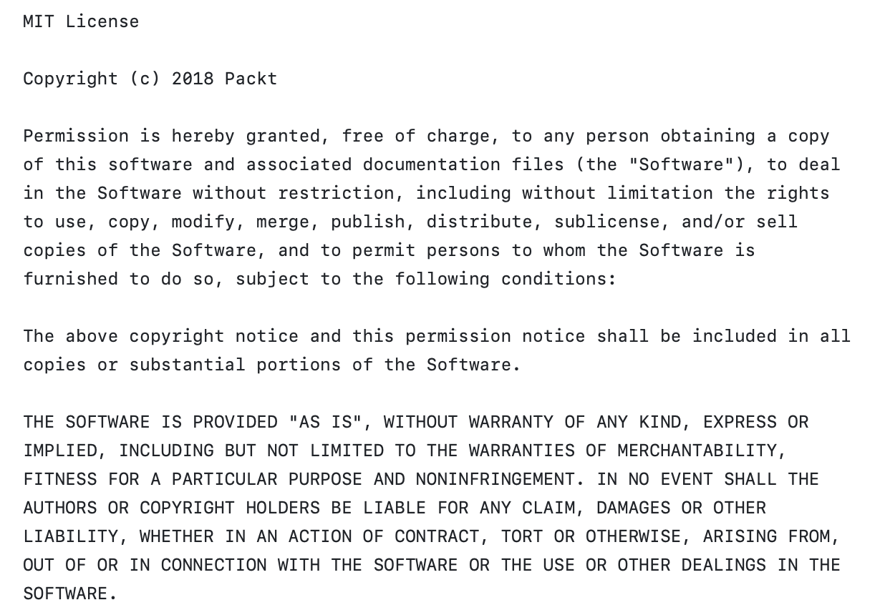

# Face Detection with Qt and OpenCV: Chapter 05 Reflections

**Author**: Tony Fu  
**Date**: August 10, 2023  
**Device**: MacBook Pro 16-inch, Late 2021 (M1 Pro)  

**Reference**: Chapter 5 of [*Qt 5 and OpenCV 4 Computer Vision Projects*](https://github.com/PacktPublishing/Qt-5-and-OpenCV-4-Computer-Vision-Projects/tree/master) by Zhuo Qingliang

## Core Concepts

### 1. Issues Encountered & Solutions

- **Include Path of Tesseract Not Nested Enough**: Due to specifying the include path for Tesseract as `INCLUDEPATH += /opt/homebrew/include/tesseract` in the .pro file, I was unable to use `#include "tesseract/baseapi.h"` as it would reference the file at `/opt/homebrew/include/tesseract/tesseract/baseapi.h`.
    **Solution**: Create a symbolic link to nest the directory appropriately.
    ```bash
    cd /opt/homebrew/include
    mkdir tesseract_nested
    ln -s /opt/homebrew/include/tesseract tesseract_nested/tesseract
    ```

### 2. Optical Character Recognition (OCR) with Tesseract

- **Installation**: I opted to install Tesseract version 5.3.2_1 using Homebrew rather than building it manually. The command for installation is:
    ```bash
    brew install tesseract
    ```

- **Linking**: To link Tesseract with your project, add these lines to the `.pro` file:
    ```cpp
    # Tesseract
    unix: mac {
        INCLUDEPATH += /opt/homebrew/include/tesseract_nested
        LIBS += -L/opt/homebrew/lib -ltesseract
    }
    ```
    For an explanation of why it is `tesseract_nested` instead of `tesseract`, refer to the first issue above.

- **Specify Model Path**: You can define the model path by adding the following line to your `.pro` file:
    ```cpp
    DEFINES += TESSDATA_PREFIX=\\\"/opt/homebrew/share/tessdata/\\\"
    ```

- **Test Run Tesseract**: To test the installation, first locate the binary file using `which tesseract`, then run a command such as:
    ```bash
    /opt/homebrew/bin/tesseract $HOME/Desktop/test.png $HOME/Desktop/test.txt
    ```
  Some test cases include:

    * **Input Image**: 
      **Output**: As expected

    * **Input Image**: 
      **Output**: "ie i ovev"

    * **Input Image**: 
      **Output**: "all v All Be ply m’Kes Jack a"

    As observed, Tesseract's performance can vary with different inputs and might yield suboptimal results, particularly with handwritten text or unconventional fonts.

- **Extracting Text**: Below is a slot function that will be invoked to extract text:
    ```
    void MainWindow::extractText()
    {
        // Check if an image is currently loaded
        if (currentImage == nullptr)
        {
            QMessageBox::information(this, "Information", "No opened image.");
            return;
        }

        // Save the current locale and set it to the standard "C" locale
        char *old_ctype = strdup(setlocale(LC_ALL, NULL));
        setlocale(LC_ALL, "C");

        // Check if Tesseract API is already initialized
        if (tesseractAPI == nullptr)
        {
            tesseractAPI = new tesseract::TessBaseAPI();
            // Initialize tesseract-ocr with English, specifying the tessdata path
            if (tesseractAPI->Init(TESSDATA_PREFIX, "eng"))
            {
                QMessageBox::information(this, "Error", "Could not initialize tesseract.");
                return;
            }
        }

        // Convert the current image to a QImage in RGB888 format
        QPixmap pixmap = currentImage->pixmap();
        QImage image = pixmap.toImage();
        image = image.convertToFormat(QImage::Format_RGB888);

        // Set the image data to the Tesseract API
        tesseractAPI->SetImage(image.bits(), image.width(), image.height(),
                            3, image.bytesPerLine());

        // Get the recognized text from the image
        char *outText = tesseractAPI->GetUTF8Text();

        // Set the recognized text to the text editor
        editor->setPlainText(outText);

        // Clean up the allocated text
        delete[] outText;

        // Restore the saved locale
        setlocale(LC_ALL, old_ctype);
        free(old_ctype);
    }
    ```
    Here, 'locale' refers to the regional settings utilized by the C library for handling culturally-dependent data formats. Tesseract requires the locale to be changed to "C." The provided code saves the existing locale, switches to "C," calls the Tesseract API, and then restores the original locale.

**Results** 


