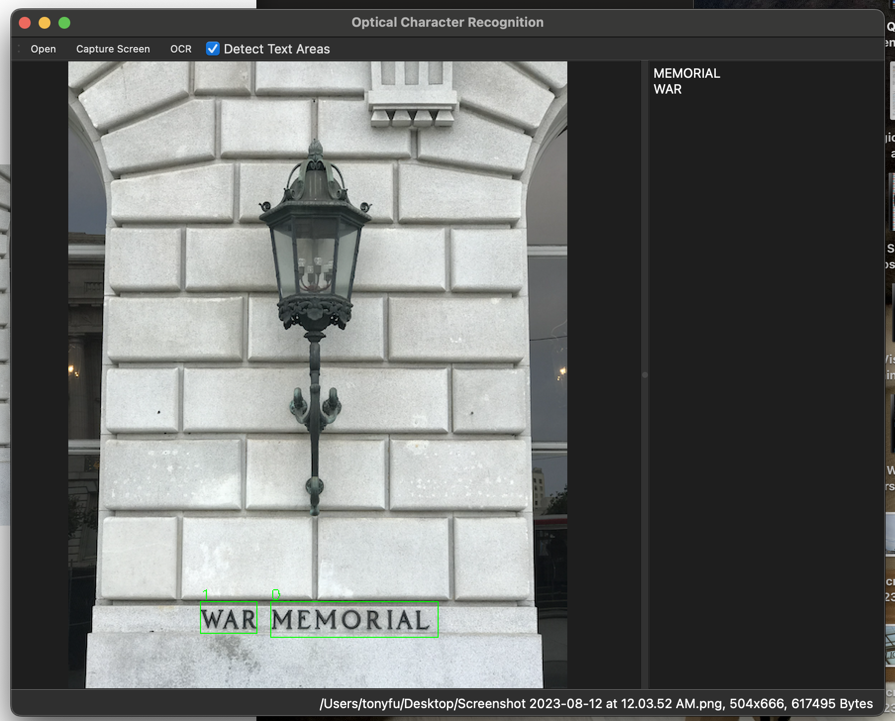

# Face Detection with Qt and OpenCV: Chapter 05 Reflections

**Author**: Tony Fu  
**Date**: August 10, 2023  
**Device**: MacBook Pro 16-inch, Late 2021 (M1 Pro)  

**Reference**: Chapter 5 of [*Qt 5 and OpenCV 4 Computer Vision Projects*](https://github.com/PacktPublishing/Qt-5-and-OpenCV-4-Computer-Vision-Projects/tree/master) by Zhuo Qingliang

## Core Concepts

### 1. Issues Encountered & Solutions

- **Include Path of Tesseract Not Nested Enough**: Due to specifying the include path for Tesseract as `INCLUDEPATH += /opt/homebrew/include/tesseract` in the .pro file, I was unable to use `#include "tesseract/baseapi.h"` as it would reference the file at `/opt/homebrew/include/tesseract/tesseract/baseapi.h`.
    **Solution**: Create a symbolic link to nest the directory appropriately.
    ```bash
    cd /opt/homebrew/include
    mkdir tesseract_nested
    ln -s /opt/homebrew/include/tesseract tesseract_nested/tesseract
    ```

- **Addressing Screen Capture DPI Scaling**: My display's scaling is set to 200%, a fact that can be verified by the value `2` returned from the line `double ratio = QApplication::desktop()->devicePixelRatio();`. Despite this, the line of code `pixmap.setDevicePixelRatio(QApplication::desktop()->devicePixelRatio());` located in the `ScreenCapturer::captureDesktop()` function doesn't produce the expected results. The captured image appears to be 2x smaller than the actual screen size. The discrepancy is likely caused by the creation of the `QPixmap` object before the scaling is properly applied.

    **Solution**: Modify the `ScreenCapturer::confirmCapture()` function as follows:

    From:
    ```cpp
    void ScreenCapturer::confirmCapture()
    {
        QPixmap image = screen.copy(QRect(p1, p2));
        window->showImage(image);
        closeMe();
    }
    ```

    To:
    ```cpp
    void ScreenCapturer::confirmCapture()
    {
        double ratio = QApplication::desktop()->devicePixelRatio();
        QRect selectedArea = QRect(p1 * ratio, p2 * ratio);
        QPixmap image = screen.copy(selectedArea);
        window->showImage(image);
        closeMe();
    }
    ```

    This solution takes into account the display's DPI scaling, ensuring that the captured image matches the actual screen size by multiplying the coordinates `p1` and `p2` by the appropriate ratio.

- **Screen Capture Only Displays Wallpaper**: When attempting to capture the screen, all folders and windows temporarily disappear, leaving only the wallpaper visible. This issue appears to be related to macOS security.

    **Solution**: Currently under investigation.

### 2. Optical Character Recognition (OCR) with Tesseract

- **Installation**: I opted to install Tesseract version 5.3.2_1 using Homebrew rather than building it manually. The command for installation is:
    ```bash
    brew install tesseract
    ```

- **Linking**: To link Tesseract with your project, add these lines to the `.pro` file:
    ```cpp
    # Tesseract
    unix: mac {
        INCLUDEPATH += /opt/homebrew/include/tesseract_nested
        LIBS += -L/opt/homebrew/lib -ltesseract
    }
    ```
    For an explanation of why it is `tesseract_nested` instead of `tesseract`, refer to the first issue above.

- **Specify Model Path**: You can define the model path by adding the following line to your `.pro` file:
    ```cpp
    DEFINES += TESSDATA_PREFIX=\\\"/opt/homebrew/share/tessdata/\\\"
    ```

- **Test Run Tesseract**: To test the installation, first locate the binary file using `which tesseract`, then run a command such as:
    ```bash
    /opt/homebrew/bin/tesseract $HOME/Desktop/test.png $HOME/Desktop/test.txt
    ```
  Some test cases include:

    * **Input Image**: 

      **Output**: As expected

    * **Input Image**: 

      **Output**: "ie i ovev"

    * **Input Image**: 

      **Output**: "all v All Be ply m’Kes Jack a"

    As observed, Tesseract's performance can vary with different inputs and might yield suboptimal results, particularly with handwritten text or unconventional fonts.

- **Extracting Text**: Below is a slot function that will be invoked to extract text:
    ```
    void MainWindow::extractText()
    {
        // Check if an image is currently loaded
        if (currentImage == nullptr)
        {
            QMessageBox::information(this, "Information", "No opened image.");
            return;
        }

        // Save the current locale and set it to the standard "C" locale
        char *old_ctype = strdup(setlocale(LC_ALL, NULL));
        setlocale(LC_ALL, "C");

        // Check if Tesseract API is already initialized
        if (tesseractAPI == nullptr)
        {
            tesseractAPI = new tesseract::TessBaseAPI();
            // Initialize tesseract-ocr with English, specifying the tessdata path
            if (tesseractAPI->Init(TESSDATA_PREFIX, "eng"))
            {
                QMessageBox::information(this, "Error", "Could not initialize tesseract.");
                return;
            }
        }

        // Convert the current image to a QImage in RGB888 format
        QPixmap pixmap = currentImage->pixmap();
        QImage image = pixmap.toImage();
        image = image.convertToFormat(QImage::Format_RGB888);

        // Set the image data to the Tesseract API
        tesseractAPI->SetImage(image.bits(), image.width(), image.height(),
                            3, image.bytesPerLine());

        // Get the recognized text from the image
        char *outText = tesseractAPI->GetUTF8Text();

        // Set the recognized text to the text editor
        editor->setPlainText(outText);

        // Clean up the allocated text
        delete[] outText;

        // Restore the saved locale
        setlocale(LC_ALL, old_ctype);
        free(old_ctype);
    }
    ```
    Here, 'locale' refers to the regional settings utilized by the C library for handling culturally-dependent data formats. Tesseract requires the locale to be changed to "C." The provided code saves the existing locale, switches to "C," calls the Tesseract API, and then restores the original locale.

**Results** (Works pretty well!) 

### 3. Efficient and Accurate Scene Text (EAST) Detection

The EAST model ([paper](https://arxiv.org/pdf/1704.03155.pdf)) is designed for detecting and localizing text regions in images. Unlike Optical Character Recognition (OCR) systems, the EAST model doesn't interpret or read the text. Instead, it identifies text regions by drawing bounding boxes or quadrilateral shapes around them. The model yields two outputs: a "score map" and a "geometry map."

- **Score Map**: A 2D array containing scores that indicate the probability of a text region being present at a specific location. The `scores` matrix is 4-dimensional, with dimensions `(1, 1, height, width)`. The first two dimensions are singleton dimensions, and the last two dimensions represent the spatial layout of the detected regions. 
- **Geometry Map**: A 2D array containing values that encode the coordinates of the quadrilateral shapes surrounding the text regions. The `geometry` matrix is also 4-dimensional, with dimensions `(1, 5, height, width)`. The first dimension is a singleton dimension, the second dimension has a size of 5, and the last two dimensions represent the spatial layout. The 5 elements of the second dimension are the height, width, vertical offset, horizontal offset, and angle, respecdtively, of the quadrilateral shape.

The EAST model is trained using the [ICDAR 2015](https://rrc.cvc.uab.es/?ch=4&com=downloads) dataset.

#### Download and Load the Model
- **Download**: The EAST model can be downloaded from [this link](http://depot.kdr2.com/books/Qt-5-and-OpenCV-4-Computer-Vision-Projects/trained-model/frozen_east_text_detection.pb) as a `.pb` file. "pb" stands for "protocol buffer," a Google-developed method for serializing structured data.
- **Load**: Use the `cv::dnn::readNet()` function to load the model into your application.
  ```cpp
  #include "opencv2/dnn.hpp"

  std::string model = QApplication::instance()->applicationDirPath().toStdString() + "/../../../models/frozen_east_text_detection.pb";
  cv::dnn::Net net = cv::dnn::readNet(model);
  ```

#### Preprocessing
- **Convert Image to Binary Large Object (BLOB)**: The input image must be converted to a blob (binary large object) before being fed into the neural network. This process is done using the `cv::dnn::blobFromImage()` function. Note that this is distinct from blob detection in computer vision.
    ```cpp
    cv::Mat frame = cv::Mat(
                            image.height(),
                            image.width(),
                            CV_8UC3,
                            image.bits(),
                            image.bytesPerLine())
                            .clone();
    cv::Mat blob;  // blob = binary large object

    // Preprocess the image to be fed into the neural network
    cv::dnn::blobFromImage(
        frame, blob,
        1.0, cv::Size(320, 320),
        cv::Scalar(123.68, 116.78, 103.94), true, false);
    // Set the processed image as the input to the neural network
    ```

#### Processing
- **Set Input**: Use the `cv::dnn::Net::setInput()` function to set the blob as the input.
- **Forward Pass**: Perform a forward pass using the `cv::dnn::Net::forward()` function. This outputs a vector containing scores (probabilities of text regions) and geometries (bounding box coordinates).
- **Decode the Output**: Utilize the `decode()` function to interpret the scores and geometries and obtain the bounding box coordinates.
  ```cpp
    void MainWindow::decode(const cv::Mat &scores, const cv::Mat &geometry, float scoreThresh,
                            std::vector<cv::RotatedRect> &detections, std::vector<float> &confidences)
    {
        // Get the height and width of the scores matrix (this represents the spatial layout of detections)
        const int height = scores.size[2];
        const int width = scores.size[3];
        for (int y = 0; y < height; ++y)
        {
            // Pointers to data for this row (y) in the scores and geometry matrices
            const float *scoresData = scores.ptr<float>(0, 0, y);
            const float *x0_data = geometry.ptr<float>(0, 0, y);
            const float *x1_data = geometry.ptr<float>(0, 1, y);
            const float *x2_data = geometry.ptr<float>(0, 2, y);
            const float *x3_data = geometry.ptr<float>(0, 3, y);
            const float *anglesData = geometry.ptr<float>(0, 4, y);
            for (int x = 0; x < width; ++x)
            {
                float score = scoresData[x];
                // Skip detections with scores lower than threshold
                if (score < scoreThresh)
                    continue;

                // Decode a prediction, transforming it into a rotated rectangle
                // Multiply by 4 because feature maps are 4 times smaller than the input image
                float offsetX = x * 4.0f, offsetY = y * 4.0f;
                float angle = anglesData[x];
                float cosA = std::cos(angle);
                float sinA = std::sin(angle);
                float h = x0_data[x] + x2_data[x];
                float w = x1_data[x] + x3_data[x];

                // Calculate offset and points to define the rotated rectangle
                cv::Point2f offset(offsetX + cosA * x1_data[x] + sinA * x2_data[x],
                                offsetY - sinA * x1_data[x] + cosA * x2_data[x]);
                cv::Point2f p1 = cv::Point2f(-sinA * h, -cosA * h) + offset;
                cv::Point2f p3 = cv::Point2f(-cosA * w, sinA * w) + offset;
                cv::RotatedRect r(0.5f * (p1 + p3), cv::Size2f(w, h), -angle * 180.0f / (float)CV_PI);

                // Add the detection and confidence score to the result vectors
                detections.push_back(r);
                confidences.push_back(score);
            }
        }
    }
    ```

#### Post-processing
- **Non-maximum Suppression**: To eliminate overlapping bounding boxes, apply the non-maximum suppression algorithm. The `cv::dnn::NMSBoxes()` function processes the bounding boxes and confidence scores and returns the indices of the retained bounding boxes.
  ```cpp
  cv::dnn::NMSBoxes(boxes, confidences, confThreshold, nmsThreshold, indices);
  ```

**Results** 