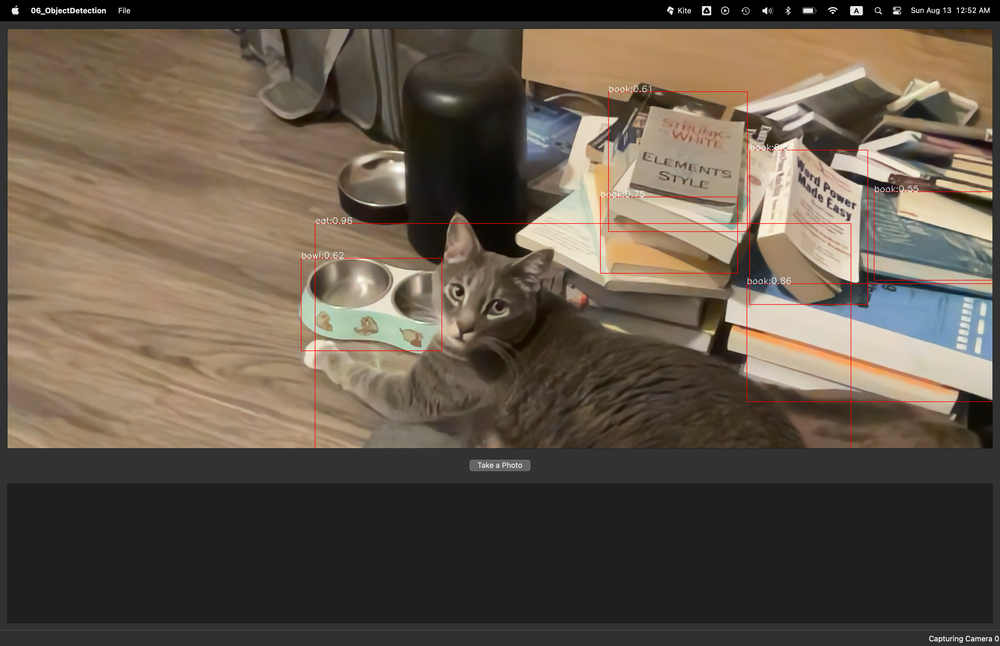

# Real-Time Object Detection with Qt and OpenCV: Chapter 06 Reflections

**Author**: Tony Fu  
**Date**: August 12, 2023  
**Device**: MacBook Pro 16-inch, Late 2021 (M1 Pro)  

**Reference**: Chapter 6 of [*Qt 5 and OpenCV 4 Computer Vision Projects*](https://github.com/PacktPublishing/Qt-5-and-OpenCV-4-Computer-Vision-Projects/tree/master) by Zhuo Qingliang

## Core Concepts

### 1. Issues Encountered & Solutions

- **Camera Privacy Error on Startup** (Repeated from Chapter 3):
  - Problem: App crash with an error about accessing privacy-sensitive data.
  - Solution: Added the following to the `Info.plist` file:
    ```xml
    <key>NSCameraUsageDescription</key>
    <string>We need access to the camera to capture video for motion detection.</string>
    ```

- **Failure to Build OpenCV 3.4.5**: This step builds the executables: `opencv_createsamples` and `opencv_traincascade`, both are deprecated functions needed to train the Haar Cascade classifier for no-entry sign detection. I first downloaded OpenCV 3.4.5 from this [link](https://github.com/opencv/opencv/releases/tag/3.4.5). 

    Then, I created a `build` directory.

    Inside the directory, I ran the following command:
    ```bash
    cmake -D CMAKE_BUILD_TYPE=RELEASE \
          -D CMAKE_INSTALL_PREFIX=/Users/tonyfu/Desktop/OnlineCourses/OpenCV-Qt-App/06_ObjectDetection/opencv-3.4.5/build \
          -D BUILD_opencv_apps=yes \
          -D JPEG_INCLUDE_DIR=/opt/homebrew/include \
          -D JPEG_LIBRARY=/path/to/jpeg/library \
          ..
    ```
    Next, I ran `make` and got the error:
    ```
    [ 50%] Linking CXX shared library ../../lib/libopencv_imgcodecs.dylib
    Undefined symbols for architecture arm64:
    "_jpeg_default_qtables", referenced from:
        cv::JpegEncoder::write(cv::Mat const&, std::__1::vector<int, std::__1::allocator<int> > const&) in grfmt_jpeg.cpp.o
    ld: symbol(s) not found for architecture arm64
    clang: error: linker command failed with exit code 1 (use -v to see invocation)
    make[2]: *** [lib/libopencv_imgcodecs.3.4.5.dylib] Error 1
    make[1]: *** [modules/imgcodecs/CMakeFiles/opencv_imgcodecs.dir/all] Error 2
    make: *** [all] Error 2
    ```

    **Solution**: Currently under investigation. Maybe there are OpenCV 4 equivalents for the two executables.

- **Undefined Template 'std::basic_ifstream<char>'**: This error occurs when compiling the `capture_thread.cpp` file. The error is as follows:
  ```
  capture_thread.cpp:121:18: error: implicit instantiation of undefined template 'std::basic_ifstream<char>'
        ifstream ifs(namesFile.c_str());
  ```

  **Solution**: include the appropriate header file:
  ```cpp
  #include <fstream>
  ```

### 2. OpenCV 4.0.0 and Above

### 2. Cat Detection with Haar Cascade:
This is very similar to Face Detection in Chapter 4. The only difference is that we are using a different classifier.

- **Classifier Storage**:  
  Haar cascade classifiers are located in `/opt/homebrew/share/opencv4/haarcascades/` in XML format.

- **Haar Cascade Implementation**:  
  To integrate the Haar Cascade classifiers:
  - Append `-lopencv_objdetect` to the LIBS within the .pro file.
  - Incorporate the `DEFINES += OPENCV_DATA_DIR=\\\"/opt/homebrew/share/opencv4/\\\"` macro. This will be referenced later during classifier loading.

  Here's a simple guide to face detection:
  ```cpp
  #include "opencv2/objdetect.hpp"

  cv::CascadeClassifier *classifier = new cv::CascadeClassifier(OPENCV_DATA_DIR "haarcascades/haarcascade_frontalcatface_extended.xml");
  
  while (running)
  {
      cap >> tmp_frame;

      // Face detection process
      vector<cv::Rect> faces;
      cv::Mat gray_frame;
      cv::cvtColor(tmp_frame, gray_frame, cv::COLOR_BGR2GRAY);
      classifier->detectMultiScale(gray_frame, faces, 1.3, 5);

      // Drawing red bounding boxes around detected faces
      cv::Scalar color = cv::Scalar(0, 0, 255); // red
      for (size_t i = 0; i < faces.size(); i++)
      {
          cv::rectangle(tmp_frame, faces[i], color, 1);
      }

      // Continuation of the code (frame update, signal emission, etc.)
  }
  ```

**Results**:


### 3. OpenCV-Compatible Neural Network Extensions:
OpenCV 4.0.0 and above supports the loading of neural network models from various frameworks. OpenCV cannot train its own DNN, but can load DNN from the following file extensions in inference mode:

1. **Caffe**: `.prototxt`, `.caffemodel`
2. **TensorFlow**: `.pb`, `.pbtxt`
3. **Torch**: `.t7`, `.net`, TorchScript
4. **Darknet (YOLO)**: `.cfg`, `.weights`
5. **ONNX**: `.onnx`
6. **DLA**: Custom format
7. **OpenVINO**: `.xml`, `.bin`
8. **Apache MXNet**: `.json`, `.params`
9. **Apple Core ML**: `.mlmodel`
10. **Chainer**: `npz`

### 4. YOLOv3 Object Detection:

This code block demonstrates how to use YOLOv3 (You Only Look Once version 3) for object detection using OpenCV.

1. **Include OpenCV's Deep Neural Network (DNN) module**: This is required to work with neural networks, including YOLO.

    ```cpp
    #include "opencv2/dnn.hpp"
    ```

2. **Set Input Dimensions**: Define the width and height that the model expects for its input.

    ```cpp
    int inputWidth = 416;
    int inputHeight = 416;
    ```

3. **Load the YOLO Model**: Provide the paths to the configuration and weights files.

    ```cpp
    string modelConfig = "data/yolov3.cfg";
    string modelWeights = "data/yolov3.weights";
    cv::dnn::Net net = cv::dnn::readNetFromDarknet(modelConfig, modelWeights);
    ```

4. **Load Class Names**: Read the class names from a file and store them in a vector. There are 80 categories available for detection. You can view them in the [coco.names](data/coco.names) file. `ifstream` stands for "input file," and an ifstream object is used to open and read from files.

    ```cpp
    #include <fstream>

    vector<string> objectClasses;
    string name;
    string namesFile = "data/coco.names";
    ifstream ifs(namesFile.c_str());
    while(getline(ifs, name)) objectClasses.push_back(name);
    ```

5. **Preprocess the Image**: Convert the image to a blob (binary large object), a format required for feeding into the neural network.

    ```cpp
    cv::Mat blob;
    cv::dnn::blobFromImage(frame, blob, 1 / 255.0, cv::Size(inputWidth, inputHeight), cv::Scalar(0, 0, 0), true, false);
    net.setInput(blob);
    ```

6. **Run Forward Pass**: Pass the blob through the network to get the detection results.

    ```cpp
    vector<cv::Mat> outs;
    net.forward(outs, getOutputsNames(net));
    ```

7. **Decode Outputs**: Process the network's output to extract the detected objects' information.

    ```cpp
    vector<int> outClassIds;
    vector<float> outConfidences;
    vector<cv::Rect> outBoxes;
    decodeOutLayers(frame, outs, outClassIds, outConfidences, outBoxes);
    ```

8. **Draw Bounding Boxes and Labels**: Iterate through the detected objects, draw bounding boxes around them, and display the class name and confidence level.

    ```cpp
    for(size_t i = 0; i < outClassIds.size(); i ++) {
        // drawing and labeling code here
    }
    ```

**Results**:



Detecting time on a single frame:  101-110 ms
YOLO: Inference time on a single frame:  98-105 ms