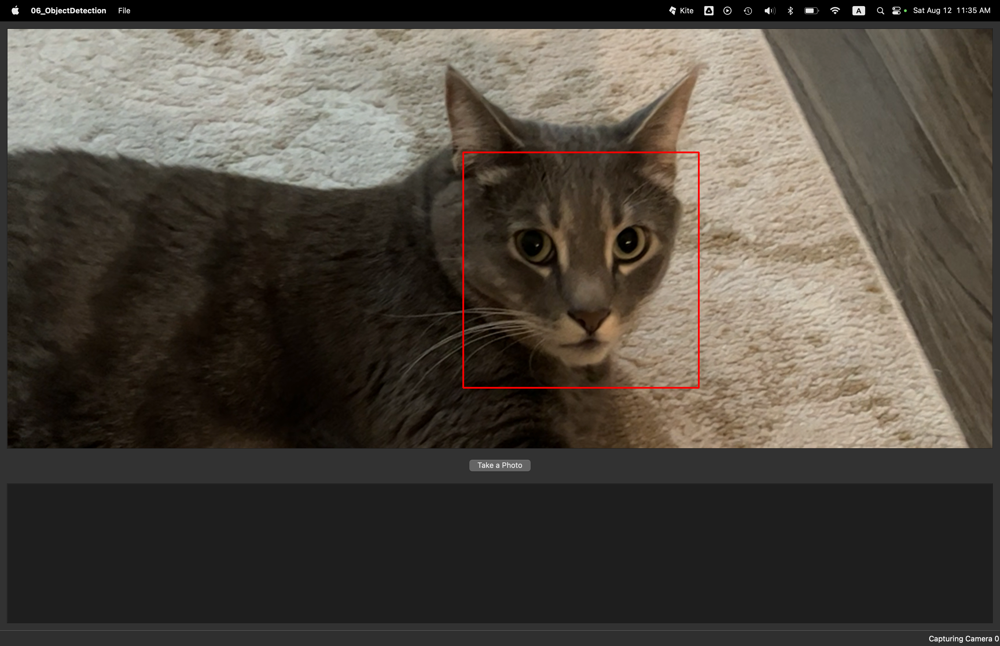

# Real-Time Object Detection with Qt and OpenCV: Chapter 06 Reflections

**Author**: Tony Fu  
**Date**: August 12, 2023  
**Device**: MacBook Pro 16-inch, Late 2021 (M1 Pro)  

**Reference**: Chapter 6 of [*Qt 5 and OpenCV 4 Computer Vision Projects*](https://github.com/PacktPublishing/Qt-5-and-OpenCV-4-Computer-Vision-Projects/tree/master) by Zhuo Qingliang

## Core Concepts

### 1. Issues Encountered & Solutions

- **Camera Privacy Error on Startup** (Repeated from Chapter 3):
  - Problem: App crash with an error about accessing privacy-sensitive data.
  - Solution: Added the following to the `Info.plist` file:
    ```xml
    <key>NSCameraUsageDescription</key>
    <string>We need access to the camera to capture video for motion detection.</string>
    ```

### 2. Cat Detection with Haar Cascade:
This is very similar to Face Detection in Chapter 4. The only difference is that we are using a different classifier.

- **Classifier Storage**:  
  Haar cascade classifiers are located in `/opt/homebrew/share/opencv4/haarcascades/` in XML format.

- **Haar Cascade Implementation**:  
  To integrate the Haar Cascade classifiers:
  - Append `-lopencv_objdetect` to the LIBS within the .pro file.
  - Incorporate the `DEFINES += OPENCV_DATA_DIR=\\\"/opt/homebrew/share/opencv4/\\\"` macro. This will be referenced later during classifier loading.

  Here's a simple guide to face detection:
  ```cpp
  #include "opencv2/objdetect.hpp"

  cv::CascadeClassifier *classifier = new cv::CascadeClassifier(OPENCV_DATA_DIR "haarcascades/haarcascade_frontalcatface_extended.xml");
  
  while (running)
  {
      cap >> tmp_frame;

      // Face detection process
      vector<cv::Rect> faces;
      cv::Mat gray_frame;
      cv::cvtColor(tmp_frame, gray_frame, cv::COLOR_BGR2GRAY);
      classifier->detectMultiScale(gray_frame, faces, 1.3, 5);

      // Drawing red bounding boxes around detected faces
      cv::Scalar color = cv::Scalar(0, 0, 255); // red
      for (size_t i = 0; i < faces.size(); i++)
      {
          cv::rectangle(tmp_frame, faces[i], color, 1);
      }

      // Continuation of the code (frame update, signal emission, etc.)
  }
  ```

**Results**:




