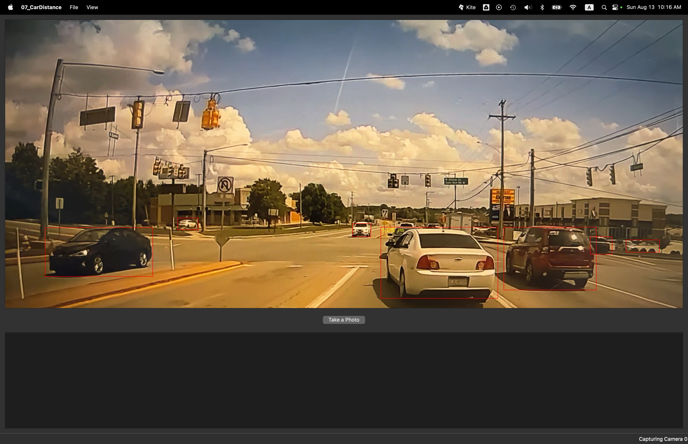

# Real-Time Car Distance Estimation with Qt and OpenCV: Chapter 07 Reflections

**Author**: Tony Fu  
**Date**: August 13, 2023  
**Device**: MacBook Pro 16-inch, Late 2021 (M1 Pro)  

**Reference**: Chapter 7 of [*Qt 5 and OpenCV 4 Computer Vision Projects*](https://github.com/PacktPublishing/Qt-5-and-OpenCV-4-Computer-Vision-Projects/tree/master) by Zhuo Qingliang

## Overview

This project demonstrates real-time car distance estimation using Qt and OpenCV. The main logic resides within the `capture_thread.cpp` file, and the application draws on two principal methods for distance estimation:

### 1. Measuring Distances Between Cars in Bird's Eye View

The distance between cars is calculated using the following equation:

\[
\text{distance} = \left(\text{width_of_space}\right) \times \frac{5.0}{\text{median_car_width}}
\]

where:
- **width_of_space (pixels)**: The width of the space between two cars in the image.
- **5.0 (meters)**: The author assumes the median length of a car in the real world is 5 meters.
- **median_car_width (pixels)**: The median width of the cars in the image, represented by the `length` variable in the `distanceBirdEye()` function.

### 2. Using Triangle Similarity to Estimate Distance to a Car

The application employs triangle similarity to derive the distance between the camera and the car. The resulting formula is as follows:

\[
d1 = \frac{d0 \times w0}{w1}
\]

where:
- **d0**: (constant) Initial distance between the camera and the car (1000 cm in the book).
- **d1**: (dependent variable) Distance to be estimated between the camera and the car.
- **w0**: (constant) Width of the car in the image when it is d1 away from the camera (150 pixels in the book).
- **w1**: (independent variable) Width of the car in the image when it is d0 away from the camera.

Since the product \(d0 \times w0\) is constant, the above formula provides a straightforward way to compute the distance.

## Results

The image below illustrates an example of the distance measurement in action:

